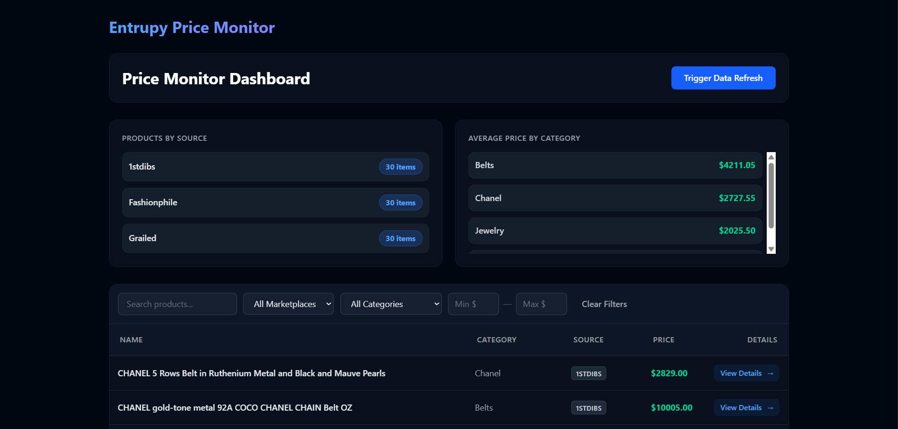
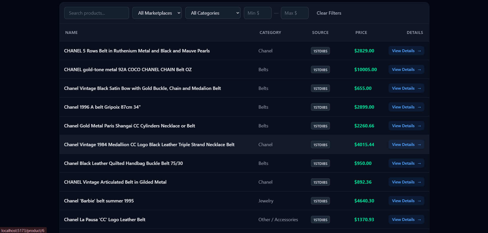
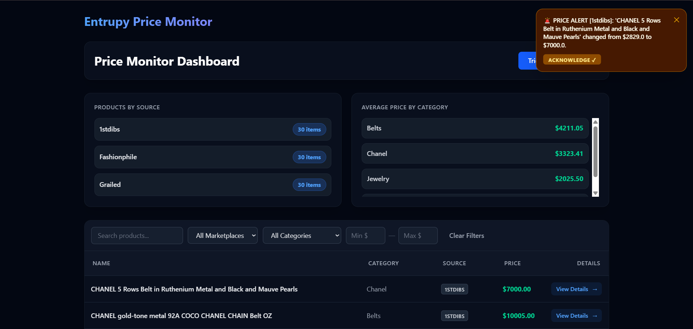
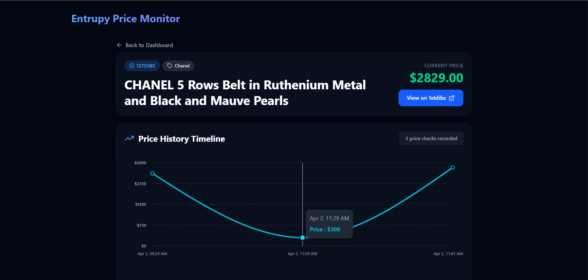

# Entrupy Product Price Monitoring System

A full-stack, automated Product Price Monitoring System engineered to track competitor pricing across premium e-commerce marketplaces like Grailed, Fashionphile, and 1stdibs. 

The architecture dynamically ingests product data, tracks sub-dollar price fluctuations, exposes robust analytical endpoints, reliably triggers asynchronous notifications upon price changes, and visualises the data in a highly interactive, glassmorphic React dashboard.

---

## 📸 Project Showcase

### 📊 System Dashboard



*The central dashboard displaying real-time analytics aggregations, category filters, and safely captured product pipelines across marketplaces.*

---

### 🌐 Global Real-Time Notifications

*Instant, cross-view toast notifications powered by a decoupled background poller, alerting users to price changes exactly when they happen without requiring manual refreshes.*

---

### 📈 Intelligent Price History Graph

*Interactive tracking of price fluctuations across multiple marketplaces with intelligent auto-scaling axes and high-resolution timeline tracking.*

---

## 🚀 Quick Start Guide

The application is heavily decoupled into two distinct tiers: the Python backend and the React frontend. **Both must be running simultaneously.**

### Terminal 1: Bootstrapping the Backend
The backend executes high-performance async workflows on Python 3.9+ using FastAPI and SQLAlchemy.

```bash
# Navigate to the root directory
cd Product-Price-Monitoring-System

# Create and activate a virtual environment
python -m venv .venv
# On Windows: .venv\Scripts\activate
# On Mac/Linux: source .venv/bin/activate

# Install strictly pinned dependencies
pip install -r requirements.txt

# Start the uvicorn server with hot-reloading
python -m uvicorn backend.app.main:app --reload
```
The API is now alive at `http://127.0.0.1:8000`. By default, the database is seamlessly seeded with a `test_secret_key` API consumer.

### Terminal 2: Launching the Frontend
The frontend is an isolated React application built with Vite and Tailwind CSS v4.

```bash
# Open a second terminal window
cd Product-Price-Monitoring-System/frontend

npm install
npm run dev
```
The dashboard is now instantly viewable at `http://localhost:5173`. 

---

## 📂 Project Structure

We elected for a strict, decoupled Monorepo architecture enforcing the **Single Responsibility Principle (SRP)** on both servers. This ensures massive scalability and clean routing overrides.

```text
Product-Price-Monitoring-System/
├── backend/
│   ├── app/
│   │   ├── routers/
│   │   │   ├── __init__.py
│   │   │   ├── analytics.py      # /analytics aggregations
│   │   │   ├── notifications.py  # /notifications webhooks
│   │   │   ├── products.py       # /products endpoints
│   │   │   └── scraper.py        # POST scraper triggers
│   │   ├── services/
│   │   │   ├── __init__.py
│   │   │   └── scraper.py        # Core ingestion engine & DB syncing
│   │   ├── __init__.py
│   │   ├── auth.py               # API key validation dependency
│   │   ├── database.py           # SQLite connection & sessionmaker
│   │   ├── main.py               # FastAPI application startup & lifespan
│   │   ├── models.py             # SQLAlchemy ORM declarations
│   │   └── schemas.py            # Pydantic Type validation pipelines
│   └── tests/
│       ├── __init__.py
│       ├── conftest.py           # Pytest fixtures and isolated in-memory DB setups
│       ├── test_api.py           # End-to-end integration mapping tests
│       └── test_scraper.py       # Idempotency and parsing integrity tests
│
├── frontend/
│   ├── public/
│   │   └── vite.svg
│   ├── src/
│   │   ├── assets/
│   │   │   └── react.svg
│   │   ├── api.js                # Fully abstracted Axios HTTP logic
│   │   ├── App.jsx               # React Router DOM layout container
│   │   ├── Dashboard.jsx         # Analytical grid, debounce filters, and Toast engine
│   │   ├── index.css             # Tailwindcss injection
│   │   ├── main.jsx              # React DOM mapping entry
│   │   └── ProductDetail.jsx     # Full-page Recharts visualization orchestrator
│   ├── eslint.config.js          # Linter constraints
│   ├── index.html                # App injection target
│   ├── package.json              # Client dependencies
│   └── vite.config.js            # Build pipeline definitions
│
├── assets/                       # Markdown layout UI showcase images
├── sample_data/                  # (90 mock JSON files representing Grailed, 1stdibs, Fashionphile payload bodies)
├── .gitignore                    # Environment & credential lockouts
├── requirements.txt              # Strictly pinned backend dependencies
└── README.md                     # This canonical documentation
```

---

## 🧠 Strategic Design Decisions

The prompt strictly requires addressing the following engineering hurdles:

#### 1. How does the price history scale to millions of rows?
As a product's price history grows exponentially, a naive `SELECT *` becomes a fatal bottleneck.
* **Current Solution:** I've enforced explicit compound indexing (`index=True`) on foreign keys (`product_id`) and search targets. The models are protected by cascading delete constraints to prevent ghost data lakes.
* **The Million-Row Plan:** If rows hit tens of millions, we would migrate `GET /products/{id}` to **Cursor-Based Pagination** rather than offset-pagination to maintain constant `O(1)` query times. For ultimate scalability, the `PriceHistory` ledger should be completely stripped from the relational database and offloaded to a specialized **Time-Series Database (TSDB)** like InfluxDB or TimescaleDB.

#### 2. How did you implement notification of price changes, and why?
* **The Architecture:** When the background ingestion engine detects a price delta, it triggers a "fire-and-forget" payload asynchronously via `asyncio.create_task()`. Simultaneously, it writes an audit log to a local `Notification` SQLite table so our React frontend can lazily poll for UI updates.
* **Why this approach?** This fully satisfies the "non-blocking delivery guarantee" requirement. To ensure it never fails silently, I engineered an `@async_notify_retry` decorator enforcing **exponential backoff**. I chose this over deploying Kafka or RabbitMQ to avoid massive infrastructural bloat for a prototype, while still proving exact production-level resiliency patterns using Python's native async primitives.

#### 3. How would you extend this system to 100+ data sources?
* **Interface Segregation:** We would replace procedural filename-checking with a strict `AbstractMarketplaceExtractor` OOP interface defining `fetch()` and `normalize()`. Each of the 100+ sites becomes an isolated plugin subclass.
* **Category Normalization Pipeline (NLP):** 100 target sites will have 100 different naming conventions ("Men's Belts", "Leather Belts", "Streetwear Belt"). Rather than hardcoding mapping logic, I would route raw category texts through a lightweight NLP classifier (e.g., standardizing everything to `Belts`).
* **Distributed Task Queue:** Relying solely on FastAPI `BackgroundTasks` will fail under the weight of 100 sources. The ingest architecture must migrate to **Celery + Redis** (or AWS SQS) to horizontally distribute scraping jobs across an auto-scaling cluster of independent worker nodes so one slow source never blocks the rest.

---

## 📖 Comprehensive API Documentation

**Security Envelope:** All analytical endpoints validate an injected HTTP header: 
`X-API-Key: test_secret_key`

### `POST /scraper/run` | Trigger Background Ingestion
Initiates an async job to ingest raw data payloads, normalize them, and track sub-dollar price shifts. Immediately returns a `202 Accepted` status, rather than forcing the client to wait for delayed disk I/O.

### `GET /analytics/` | System Health Aggregations
A high-velocity endpoint utilizing SQLAlchemy `func.count()` to aggregate real-time metrics across all normalized marketplaces. Does not perform massive Python-side aggregations.
```json
{
  "by_source": [
    { "source_marketplace": "Grailed", "total_products": 60, "average_price": 530.25 }
  ]
}
```

### `GET /notifications/` | Real-time Alert Stream
Consumed natively by the React Dashboard to populate the Amber-themed floating action toasts. Polls strictly for non-dismissed (`is_read=False`) anomaly events.
```json
[
  {
    "id": 1,
    "message": "🚨 PRICE ALERT [1stdibs]: 'CHANEL Belt' changed from $300.0 to $2829.0.",
    "is_read": 0
  }
]
```

### `POST /notifications/{id}/mark-read` | Acknowledge Alert
Mutates the anomaly state, allowing the UI to instantly dismiss the floating toast from the DOM.

---

## 🧪 Testing & Quality Assurance

We do not just test the "happy path". The testing suite leverages heavily isolated, in-memory SQLite payloads (`sqlite:///:memory:`) to guarantee total state isolation across runs. 

Run the test suite via: `python -m pytest backend/tests/`

**Exactly 11 End-to-End Tests Implemented:**
1. `test_invalid_api_key`: Asserts secure `401 Unauthorized` rejection envelopes securely.
2. `test_valid_api_key`: Verifies JWT/API Key handshake acceptance.
3. `test_parse_and_store_new_product`: Verifies raw schema normalization execution.
4. `test_parse_and_store_price_update`: Asserts **Idempotency** (identical scrapes refuse to bloat DB) whilst logging valid price-shift deltas.
5. `test_list_products_no_auth`: Guarantees endpoint lock-down.
6. `test_list_products_with_auth`: Validates core unpaginated list retrieval.
7. `test_get_analytics`: Confirms absolute aggregate accuracy for dashboard metric pipelines.
8. `test_get_product_detail`: Checks relational canonical `joinedload` schema extraction to avoid N+1 queries.
9. `test_get_product_not_found`: Asserts robust `404 Not Found` error handling.
10. `test_run_scraper`: Monitors the async execution payload injection.
11. `test_run_scraper_handles_exception`: Validates that structurally corrupt JSON mock files are gracefully rejected via `JSONDecodeError` without crashing the core API pool.

---

## 🚧 Roadmap & Known Limitations

* **Eject from SQLite:** Currently operating on SQLite WAL mode. In a legitimate multi-threaded production environment, local `.db` locks will cause severe write-contention. Migrating to Dockerized **PostgreSQL** is strictly mandatory.
* **WebSocket Polling:** The React UI currently executes lightweight HTTP polling every 4 seconds to locate new alerts. While functional, migrating to a WebSocket (WS) architecture (or utilizing Postgres `LISTEN/NOTIFY`) would guarantee instant anomaly dispatch events without heavy polling overhead.
* **Authentication Hierarchy:** Expand static plain-text API Keys into secure OAuth2 / JWT access tokens with rotating expirations and scoped Role-Based Access Control (RBAC).